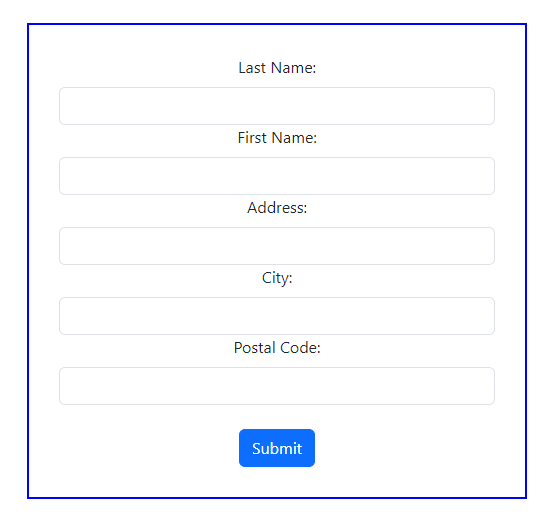
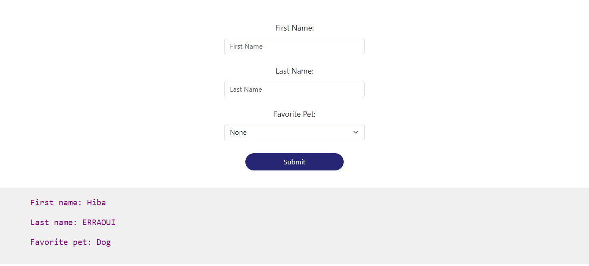
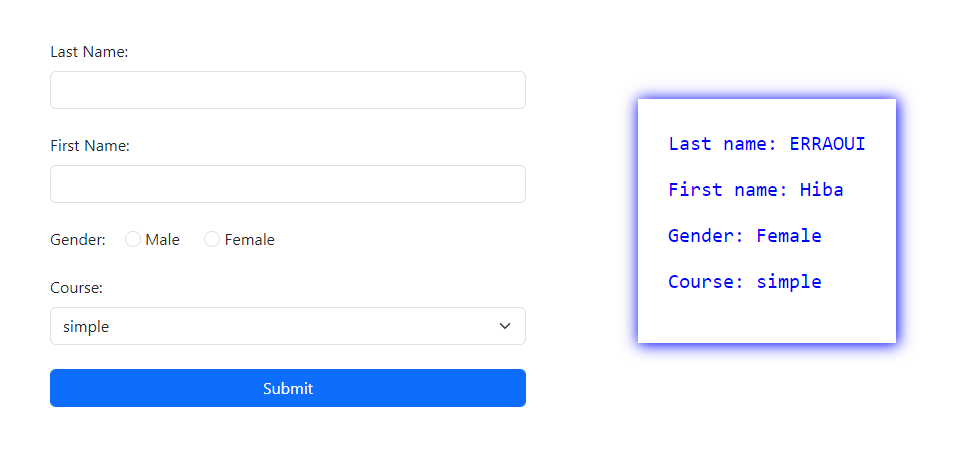
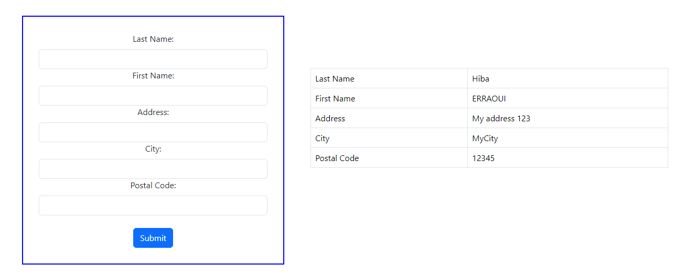

## Description
A collection of three simple PHP forms demonstrating form creation, data submission, and display.

♡ The first form collects user details (last name, first name, and favorite pet) and displays the information in a formatted manner.  
♡ The second form collects last name, first name, gender, and course selection, displaying the data similarly.  
♡ The third form collects last name, first name, address, city, and postal code, displaying the information in a table format.  

All forms are styled using Bootstrap.

## Screenshots

| Form 1 | Form 2 | Form 3 |
|--------|--------|--------|
|  |  |  |

